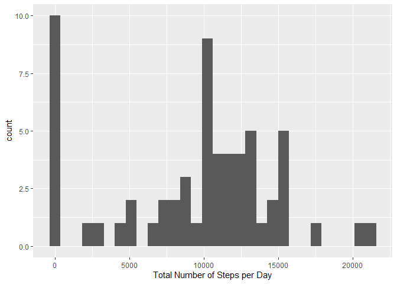
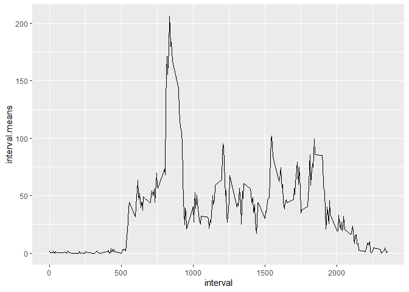
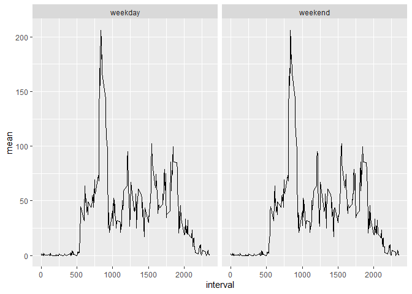

## Loading and preprocessing the data

```r
library(tidyverse)
```

```
## ── Attaching packages ─────────────────────────────────────── tidyverse 1.3.2 ──
## ✔ ggplot2 3.4.0      ✔ purrr   1.0.0 
## ✔ tibble  3.1.8      ✔ dplyr   1.0.10
## ✔ tidyr   1.2.1      ✔ stringr 1.5.0 
## ✔ readr   2.1.3      ✔ forcats 0.5.2 
## ── Conflicts ────────────────────────────────────────── tidyverse_conflicts() ──
## ✖ dplyr::filter() masks stats::filter()
## ✖ dplyr::lag()    masks stats::lag()
```

```r
library(lubridate)
```

```
## Loading required package: timechange
## 
## Attaching package: 'lubridate'
## 
## The following objects are masked from 'package:base':
## 
##     date, intersect, setdiff, union
```

```r
dat <- read.csv("activity.csv", header = TRUE)

dat.sum <- dat %>% group_by(date) %>% summarise(total = sum(steps, na.rm = TRUE))
dat.sum %>% ggplot( aes(total))+
  geom_histogram()+
  labs(x = "Total Number of Steps per Day")
```

```
## `stat_bin()` using `bins = 30`. Pick better value with `binwidth`.
```

<!-- -->


## What is mean total number of steps taken per day?


```r
report <- data.frame(mean = mean(dat.sum$total), med = median(dat.sum$total))
print(report)
```

```
##      mean   med
## 1 9354.23 10395
```


## What is the average daily activity pattern?


```r
intervals <- dat %>% group_by(interval) %>% summarize(interval.means = mean(steps, na.rm = TRUE))
intervals %>% ggplot(aes(x = interval, y = interval.means))+
  geom_line()
```

<!-- -->

```r
max <- arrange(intervals, desc(interval.means))[1,]
```

Interval with maximum steps is ```max[1,1]``` .

## Imputing missing values


```r
dat2 <- dat %>% group_by(interval) %>% mutate(mean = mean(steps, na.rm = TRUE)) %>% ungroup()
dat2$imputed <- if_else(is.na(dat2$steps), dat2$mean, as.double(dat2$steps))
new.dat <- dat2 %>% select("steps" = imputed, date, interval, mean) 
new.dat.sum <- new.dat %>% group_by(date) %>% summarise(total = sum(steps))
            
new.dat.sum %>% ggplot(aes(total))+
  geom_histogram()
```

```
## `stat_bin()` using `bins = 30`. Pick better value with `binwidth`.
```

<!-- -->
Imputing values decreased the number of 0s and increases the number of days with total steps around 12,000.

### New mean and median total steps

```r
report <- data.frame(mean = mean(new.dat.sum$total), med = median(new.dat.sum$total))
print(report)
```

```
##       mean      med
## 1 10766.19 10766.19
```


## Are there differences in activity patterns between weekdays and weekends?

```r
new.dat$date <- ymd(new.dat$date)
weekday.temp <- weekdays(new.dat$date)
new.dat$weekday <- if_else(weekday.temp %in% c("Saturday","Sunday"),paste("weekend"), paste("weekday") ) %>%
  as.factor()

new.dat %>% ggplot(aes(x = interval, y = mean)) +
  geom_line() +
  facet_wrap(vars(weekday))
```

<!-- -->

There are no differences between weekday and weekend patterns.
